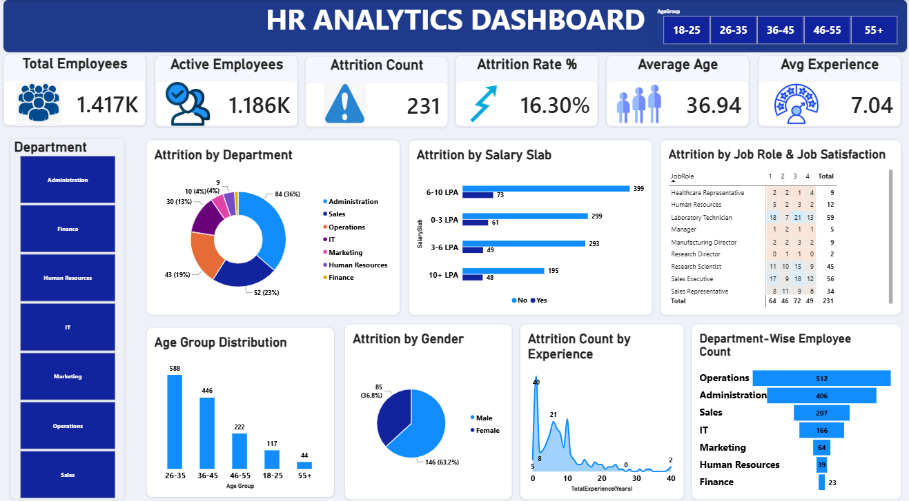

# 📊 HR Analytics Dashboard 

## 📌 Project Overview

The HR Analytics Dashboard is an interactive Power BI project developed to analyze employee workforce data and understand employee attrition, demographics, salary distribution, experience, job satisfaction, and departmental workforce patterns.

The project includes data cleaning and transformation using Power Query, data analysis using Power BI/DAX, and interactive data visualization.

---

## 🎯 Business Objectives

- Analyze overall employee workforce and active employees
- Measure employee attrition and attrition rate
- Identify attrition patterns across departments
- Analyze attrition across different salary slabs
- Understand attrition by gender and age group
- Analyze employee experience and attrition
- Examine job roles and job satisfaction
- Compare employee distribution across departments
- Present HR insights through an interactive dashboard

---

## ❓ Business Questions Answered

The dashboard was designed to answer the following HR and workforce-related business questions:

### 1. How many employees are in the organization, and how many are currently active?
The organization has **1,417 total employees**, of which **1,186 are active employees**.

### 2. How many employees have left the organization?
The dashboard records an **attrition count of 231 employees**.

### 3. What is the overall employee attrition rate?
The overall **attrition rate is 16.30%**.

### 4. Which departments are experiencing employee attrition?
The dashboard compares attrition across departments including **Sales, Operations, IT, Marketing, Human Resources, Finance, and Administration**, allowing HR teams to identify departments with higher employee exits.

### 5. How is employee attrition distributed across salary slabs?
Employee attrition is distributed across multiple **salary slabs**, allowing comparison of attrition across different salary ranges.

### 6. Which age groups are represented in the workforce?
The dashboard categorizes employees into different age groups, including **18–25, 26–35, 36–45, 46–55, and 55+**, allowing HR teams to understand workforce demographics.

### 7. Does attrition differ by gender?
The dashboard compares attrition between **male and female employees** to identify differences in employee exits.

### 8. How does employee experience relate to attrition?
The dashboard analyzes **attrition count across different levels of employee experience**, helping identify experience ranges where employee exits occur.

### 9. How does job satisfaction relate to attrition?
The dashboard compares **job roles with job satisfaction levels and attrition**, helping identify patterns that may require further HR investigation.

### 10. Which department has the largest employee workforce?
**Operations** has the largest employee workforce with **512 employees**, followed by Administration with **406 employees**.

### 11. What is the average age and experience of employees?
The dashboard reports an **average employee age of 36.94 years** and **average experience of 7.04 years**.

### 12. Can HR identify areas requiring further investigation?
Yes. By combining department, salary, age, gender, experience, job role, and job satisfaction analysis, the dashboard helps HR teams identify workforce patterns that can be investigated further.

---

## 🛠️ Tools & Technologies

- Microsoft Power BI
- Power Query
- DAX
- Data Cleaning
- Data Transformation
- Data Visualization
- HR Analytics

---

## 🧹 Data Cleaning & Transformation

Data preparation was performed directly in Power BI using Power Query.

The major transformation steps included:

- Promoting the first row as column headers
- Changing data types
- Sorting rows
- Removing unnecessary top rows
- Removing duplicate records
- Filtering rows
- Replacing values
- Creating conditional columns
- Creating an Attrition Count field
- Creating age groups for analysis

The Power Query Applied Steps used during the data preparation process are shown below.

### Power Query Transformation
---

---

## 📊 Dashboard KPIs

The dashboard provides the following key performance indicators:

| KPI | Value |
|---|---:|
| Total Employees | 1,417 |
| Active Employees | 1,186 |
| Attrition Count | 231 |
| Attrition Rate | 16.30% |
| Average Age | 36.94 |
| Average Experience | 7.04 years |

---

## 📈 Analysis Performed

### 1. Attrition Analysis
Analyzed employee attrition and overall attrition rate.

### 2. Department Analysis
Compared employee distribution and attrition across different departments.

### 3. Salary Analysis
Analyzed attrition across different salary slabs.

### 4. Age Analysis
Analyzed employee distribution across different age groups.

### 5. Gender Analysis
Compared employee attrition by gender.

### 6. Experience Analysis
Analyzed attrition patterns across employee experience levels.

### 7. Job Role & Satisfaction Analysis
Examined the relationship between job roles and job satisfaction levels.

### 8. Workforce Distribution
Analyzed employee counts across departments.

---

## 🔍 Key Findings

Based on the analysis performed in the dashboard, the following key findings were identified:

- The organization has **1,417 total employees**, with **1,186 active employees**.
- The dashboard records **231 employee attritions**, resulting in an overall **16.30% attrition rate**.
- The average employee age is **36.94 years**, while the average experience is **7.04 years**.
- **Operations** has the largest workforce among the departments, with **512 employees**.
- The dashboard shows that employee attrition varies across **departments, salary slabs, gender, age groups, experience levels, job roles, and job satisfaction levels**.
- These dimensions provide HR teams with multiple ways to investigate employee retention and workforce patterns.

---

## 📷 Dashboard Preview
---

---

## 💡 Skills Demonstrated

- Data Cleaning
- Data Transformation
- Power Query
- DAX
- KPI Development
- Data Visualization
- Dashboard Design
- Exploratory Data Analysis
- Business Analytics
- HR Analytics

---

## 📁 Project Files

- `Hr_Analytics_Dashboard_screenshot.png` — Final Power BI dashboard
- `Power Query Screenshot.png` — Data cleaning and transformation process
- `README.md` — Project documentation

---

## 👩‍💻 Author

**Mamta Choudhary**

B.Sc. Data Science & Artificial Intelligence
Interested in Data Analytics, Business Intelligence, Machine Learning, and Data Science.

Connect with me
📧 Email: choudharymamta1003@gmail.com

💼 LinkedIn: https://www.linkedin.com/in/mamta-chaudhary-964128353/

---
⭐ If you find this project useful, consider giving the repository a star!

---
